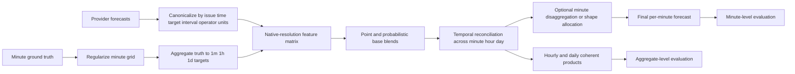
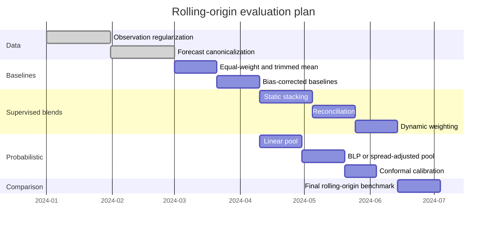

# Blending Heterogeneous Time-Series Forecasts into a Per-Minute Forecast

## Executive summary

The central technical issue is not “how to average numbers,” but how to convert heterogeneous forecasts into **comparable target objects** before blending. A provider’s forecast is only meaningful relative to its issuance time, target interval, temporal operator, and scale: a per-minute point forecast, an hourly mean, and a daily total are different forecast objects, even if they all concern the same underlying phenomenon. Temporal-hierarchy and reconciliation research treats these differences explicitly through aggregation constraints and coherent forecasts, while practical data tooling such as pandas exposes the interval-closure and labeling choices that determine which observations belong to which bucket. In a system like yours, the safest canonical representation is: **issued-at timestamp, target interval, temporal operator, value or predictive distribution in original units, and provider metadata**. Only after that representation is standardized should blending occur. citeturn26view0turn18view3turn27view0

A second key point is that **coarse forecasts do not contain fine-scale shape information**. A daily forecast can constrain a daily mean or total, but it cannot by itself identify intraday minute-to-minute variation. Temporal hierarchy work formalizes this through aggregation matrices and coherent reconciliation; recent probabilistic temporal-hierarchy work makes the same point for distributional forecasts and shows that information transfer across aggregation levels can improve high-frequency forecasting when done coherently. Operationally, that means the final per-minute product should usually be decomposed into two components: **an aggregate forecast blend** at each provider’s native or compatible resolution, and a **disaggregation or shape model** that allocates reconciled hourly/daily quantities down to minutes using intraday profiles, covariates, or higher-frequency providers. citeturn0search3turn26view0turn27view0

For **deterministic blending**, the strongest practical starting point is a staged design: begin with equal-weight and trimmed-mean baselines, add resolution- and lead-specific affine bias correction, then fit a constrained stacking model with nonnegative weights that sum to one, using only providers available for that issue time and horizon. Equal weighting remains a durable benchmark because estimated weights are often unstable, a phenomenon reviewed repeatedly in the combination literature; regression-based or stacked weights help when there is enough historical backtest data, clear covariate structure, and regime dependence. If provider participation changes over time, the entry-exit literature and specialist-expert literature both argue for masked, renormalized weights rather than forcing all providers to appear in all periods. citeturn22view1turn22view2turn16view10turn28view1turn16view9

For **probabilistic blending**, a linear pool is the baseline because it is simple and data-efficient, but the predictive-distribution literature shows that linear pooling typically increases dispersion and is not coherent in the strict forecast-combination sense. When component distributions are already reasonably calibrated, spread-adjusted or beta-transformed linear pools are usually stronger candidates; if computation and sample size permit, stacking predictive distributions is often preferable to Bayesian model averaging in misspecified-model settings. After pooling, a conformal calibration layer is attractive because it can deliver calibrated intervals with minimal distributional assumptions and can be implemented in production with existing open-source tooling. citeturn29view0turn19view3turn20search3turn16view5turn18view1

For evaluation, the report recommends **rolling-origin backtesting** with expanding and rolling windows, explicit reporting by lead time and target resolution, and separate measurement of **aggregate accuracy**, **per-minute disaggregation accuracy**, and **coherence error**. Cross-validation procedures that preserve temporal order remain the default under non-stationarity; blocked CV may be acceptable for sufficiently stationary data, while standard fold-based CV is only defensible under more restrictive autoregressive conditions. Metrics should include MAE and RMSE for point accuracy, MAPE only when the target is strictly positive and has a natural zero, and CRPS plus calibration diagnostics for probabilistic forecasts. citeturn16view7turn33view2turn33view0turn33view1turn24view0turn16view2turn16view4

The recommended implementation roadmap is therefore: **canonicalize forecast objects**, **regularize the observation grid**, **evaluate providers at compatible resolutions**, **fit deterministic and probabilistic blend baselines**, **add temporal reconciliation**, **add availability-aware time-varying weighting**, and only then **introduce minute-level disaggregation and probabilistic calibration**. That roadmap scales well because the early methods are low-latency and robust, while more complex methods such as stacked ensembles, dynamic model averaging, deep temporal-hierarchy models, and probabilistic reconciliation can be introduced only if historical data volume, latency budget, and operational value justify them. citeturn18view2turn7search2turn7search12turn16view9turn27view0

## Problem framing and alignment architecture

A rigorous blend should start from a **canonical target schema**. Let minute-level ground truth be \(y_t\), observed on a regular grid \(t \in \mathcal{T}_{1m}\). Provider \(i\), issued at time \(\tau\), produces a forecast for target interval \(I=[s,e)\) with temporal operator \(g\) such as sum, average, or end-of-interval level, and output either as a point value \(x_i(\tau, I, g)\) or predictive distribution \(F_i(\cdot \mid \tau, I, g)\). This framing matches the temporal-aggregation view in which higher-level series are formed from non-overlapping lower-level intervals and then linked by linear constraints. It also makes explicit that a “3-day horizon” and a “72-hour horizon” are only comparable after you map both to the same absolute target interval definition. citeturn27view0turn26view0turn18view3

The minute observation series should first be put on a **complete regular grid**, with missingness represented explicitly rather than silently dropped. In practice that means constructing an equally spaced index, conforming observations to it, and only then applying resampling or aggregation. This matters for both estimation and evaluation: scikit-learn’s `TimeSeriesSplit` explicitly requires equally spaced samples for comparable fold metrics, and pandas’ `date_range`, `asfreq`, and `resample` APIs make the regularization and bucket semantics explicit. citeturn16view6turn30search0turn30search1turn18view3

The most important alignment choice is **interval semantics**. If the provider forecast is an hourly average, then the aligned ground truth should be the minute observations averaged over exactly that hour; if the provider forecast is a daily total, the aligned ground truth should be the daily sum over the same closed-open interval. Pandas documents the bucket controls—especially `closed` and `label`—that determine how timestamps are binned, and temporal-reconciliation work assumes non-overlapping aggregates defined by precise aggregation matrices. A large share of “provider bias” in real systems is actually bucket misalignment. citeturn18view3turn26view0turn27view0

For **downsampling**, aggregate the minute truth to every provider-native resolution that will be scored or used for supervised blending. For **upsampling**, avoid evaluating a lower-frequency provider by simply copying a daily or hourly value to every minute unless that replication is itself the operational target. Temporal-hierarchy research shows why: the coarse forecast constrains the aggregate, not the intraday path. If the final product must be minute-level, the correct architecture is usually to (a) blend and reconcile at compatible resolutions, then (b) disaggregate using a minute-level shape model conditioned on time-of-day, day-of-week, regime, exogenous covariates, and any higher-frequency providers that are available. citeturn0search3turn26view0turn27view0

A practical disaggregation layer can be simple or sophisticated. At the low end, use a conditioned historical profile to allocate hourly or daily forecasts down to minutes and force exact coherence after allocation. At the high end, fit a supervised allocator that predicts minute proportions within an hour or day, then rescales those proportions to sum to the reconciled aggregate. The recent coherent probabilistic temporal-hierarchy literature supports exactly this idea of sharing information across levels and enforcing consistency after or during prediction. citeturn27view0

Normalization should be treated as a **training convenience, not a target definition**. If provider forecasts arrive “normalized but differing in scale,” blending should still occur in a space where values remain interpretable and invertible to the operational unit. Linear scaling such as z-scores can be fit on training folds and inverted later; robust scaling and quantile transforms may improve supervision under outliers, but non-linear transforms no longer preserve linear aggregation relationships, so reconciliation should usually occur after inversion back to original units. Scikit-learn documents that `StandardScaler` is linear, while `QuantileTransformer` is explicitly non-linear and may distort linear relationships. citeturn18view6turn13search3turn18view7turn26view0

For skewed positive targets, Box-Cox can be useful, but SciPy’s implementation requires positive inputs; Yeo-Johnson is more flexible because it can handle zero and negative values. Those transformations can stabilize learning for stackers and meta-models, but they should generally be inverted before temporal reconciliation and before external reporting. citeturn18view4turn18view5

Bias correction should be treated separately from weighting. The classic Mincer-Zarnowitz framework shows that a forecast can be improved by correction for bias and inefficiency, and later work on entry-exit settings recommends projecting actuals on the equal-weighted forecast with intercept and slope terms when provider participation is irregular. In practice, estimate a rolling or rolling-origin affine correction by provider, resolution, lead bucket, and possibly seasonality regime before feeding corrected values into the combiner. citeturn16view11turn16view10

## Literature survey and prioritized sources

The table below prioritizes sources that are especially useful for your problem formulation. The first block defines the core combination and reconciliation theory; the second block covers probabilistic pooling and calibration; the third block covers evaluation and operational implementation.

| Priority | Source | Why it matters for this problem |
|---|---|---|
| Highest | Bates & Granger, *The Combination of Forecasts* (1969) citeturn25search1 | Seminal weighted-average forecast combination paper; foundational for deterministic blending. |
| Highest | Clemen, *Combining forecasts: A review and annotated bibliography* (1989) citeturn0search5turn22view0 | Canonical review; still the reference point for why combinations often outperform individual models. |
| Highest | Athanasopoulos et al., *Forecasting with Temporal Hierarchies* (2017) citeturn0search3 | Directly relevant to multi-resolution blending across minute, hour, and day. |
| Highest | Wickramasuriya, Athanasopoulos, Hyndman, *Optimal Forecast Reconciliation through Trace Minimization* (2019) citeturn0search2turn0search14 | MinT is the main reconciliation method for coherent hierarchical forecasts. |
| Highest | Athanasopoulos et al., *Forecast reconciliation: A review* (2024) citeturn26view0 | Best recent survey that unifies cross-sectional, temporal, cross-temporal, Bayesian, ML, and probabilistic reconciliation. |
| Highest | Gneiting & Raftery, *Strictly Proper Scoring Rules, Prediction, and Estimation* (2007) citeturn16view2 | The core reference for proper scoring rules, including CRPS and log score. |
| Highest | Gneiting, Balabdaoui, Raftery, *Probabilistic Forecasts, Calibration and Sharpness* (2007) citeturn16view4 | Defines the calibration-versus-sharpness paradigm and PIT-based diagnostics. |
| Highest | Gneiting & Ranjan, *Combining Predictive Distributions* (2013) citeturn29view0 | Key theory for linear pools, spread-adjusted pools, beta-transformed pools, coherence, and dispersion. |
| High | Hall & Mitchell, *Combining density forecasts* (2007) citeturn19view3 | Practical density-forecast combination via linear pools and scoring-rule-based weight selection. |
| High | Raftery et al., *Using Bayesian Model Averaging to Calibrate Forecast Ensembles* (2005) citeturn1search1turn1search5 | Standard BMA reference for calibrated probabilistic combining. |
| High | Yao et al., *Using Stacking to Average Bayesian Predictive Distributions* (2018) citeturn20search3turn34search4 | Strong modern reference for predictive-distribution stacking versus BMA. |
| High | Raftery, Kárný, Ettler, *Dynamic Model Averaging* (2010) citeturn21search1turn21search16 | Time-varying weights under model uncertainty; useful when provider performance regimes drift. |
| High | Capistrán & Timmermann, *Forecast Combination With Entry and Exit of Experts* (2009 working-paper version) citeturn16view10 | Directly relevant to irregular provider availability and sparse expert histories. |
| High | Bosch et al., *Multi-layer Stack Ensembles for Time Series Forecasting* (2025) citeturn16view9 | Recent evidence that stacking improves time-series ensembles across many real datasets. |
| High | Rangapuram et al., *Coherent Probabilistic Forecasting of Temporal Hierarchies* (2023) citeturn27view0 | Important if you need coherent probabilistic forecasts across temporal levels. |
| High | Tashman, *Out-of-sample tests of forecasting accuracy* (2000) citeturn33view2 | Standard reference for rolling-origin evaluation design. |
| High | Bergmeir, Hyndman, Koo, *Validity of cross-validation for autoregressive time series prediction* (2018) citeturn33view1 | Clarifies when conventional CV can and cannot be justified for time series. |
| High | Cerqueira, Torgo, Mozetič, *Evaluating time series forecasting models* (2020) citeturn33view0 | Best empirical comparison of blocked CV, holdout, and prequential methods under stationarity and non-stationarity. |
| Practical | Hyndman & Athanasopoulos, *Forecasting: Principles and Practice* time-series-CV section citeturn16view7turn24view0 | Clear operational guidance for rolling forecast origin and metric definitions. |
| Practical | pandas resampling documentation citeturn18view3turn30search0turn30search1 | Essential for implementation details around regularization, resampling, interval closure, and missing intervals. |
| Practical | MAPIE and Nixtla StatsForecast conformal documentation citeturn16view5turn18view1turn18view2 | Useful for uncertainty quantification and scalable implementation of calibrated intervals. |
| Practical | fabletools reconciliation docs citeturn18view0 | Compact operational reference for production-style forecast reconciliation APIs. |

Two conclusions from this literature are especially relevant. First, deterministic combination research still supports **simple baselines** very strongly: equal weights and trimmed means are not just placeholders but serious competitors because estimated weights are noisy and often unstable in finite samples. That is the core of the long-running “forecast combination puzzle.” citeturn22view1turn22view2

Second, temporal aggregation and probabilistic aggregation should not be treated as afterthoughts. The reconciliation literature now covers cross-sectional, temporal, and cross-temporal coherence, and the probabilistic literature makes clear that the pooling rule itself changes calibration and dispersion properties. In other words, “blend first, think about hierarchy later” is usually the wrong order. citeturn26view0turn29view0turn27view0

## Candidate blending algorithms

A useful deterministic blend at target interval \(I\) and issue time \(\tau\) can be written as
\[
\hat y(\tau,I)=b(\tau,I)+\sum_{i \in A(\tau,I)} w_i(\tau,I)\,\tilde x_i(\tau,I),
\]
where \(A(\tau,I)\) is the set of providers actually available, \(\tilde x_i\) is the provider forecast after optional normalization and bias correction, and the weights may be fixed, lead-specific, state-dependent, or learned by a meta-model. This formulation cleanly accommodates irregular provider availability by renormalizing weights over the active set. The same architecture extends to distributions via pooled CDFs or densities. citeturn16view10turn29view0

The first deterministic baseline should be **equal weighting**, optionally with a trimmed mean to remove pathological forecasts. Equal weighting has decades of empirical support and remains hard to beat when the number of providers is modest and the historical period for estimating differential skill is limited. It is also the natural backup policy when some providers are unavailable or newly onboarded. citeturn22view1turn22view2

The second deterministic baseline should be **horizon-specific performance weighting**, for example inverse-MAE or inverse-RMSE weights estimated on rolling-origin backtests. This is simple, transparent, and often useful when providers have distinct lead-time strengths. The downside is that such weights are still static within a lead bucket and can be unstable when performance histories are short or regime-dependent. That instability is one of the reasons simple averages remain strong in the literature. citeturn22view2turn24view0

A stronger deterministic option is **affine bias-corrected combination**, using a provider-level or ensemble-level intercept and slope estimated by rolling-origin regression. The Mincer-Zarnowitz logic and the Capistrán-Timmermann projection-on-equal-weight method are especially attractive when entry and exit make full multivariate regression difficult. This approach is often the lowest-risk improvement over equal weighting because it corrects level and scaling bias without demanding high-dimensional weight estimation. citeturn16view11turn16view10

The next step is **constrained stacking or regression combination**. A classical Granger-Ramanathan-style combiner fits actuals on forecast inputs; in your setting it is usually best implemented with nonnegative weights summing to one, either separately by resolution and lead bucket or with a meta-model that conditions weights on context such as hour-of-day, day-of-week, exogenous drivers, provider outage indicators, and recent error features. Recent large-scale evidence suggests that stacking can outperform simpler ensemble rules in time-series problems, though no single stacker dominates in all situations. citeturn34search20turn34search14turn16view9

For non-stationary provider skill, use **time-varying weights**. Dynamic Model Averaging is the classic Bayesian option when the “correct” model or forecast source changes over time; specialist-expert and sleeping-expert methods are the online-learning analogue when providers are intermittently missing or deliberately abstain. These methods are appealing when latency matters and weights must update sequentially, but they require careful tuning and can be harder to explain and monitor than simpler convex stackers. citeturn21search1turn21search16turn28view1

Temporal consistency should be handled by **THieF or MinT-style reconciliation** rather than by hoping a pointwise combiner will accidentally respect hourly/daily constraints. For a blend intended to serve minute-, hourly-, and daily-use cases simultaneously, a strong design is: generate or blend base forecasts at several aggregations, then reconcile them with a temporal aggregation matrix. MinT remains the standard linear reconciliation method; THieF is the natural temporal-hierarchy framework when resolutions differ materially. citeturn0search3turn0search2turn26view0

For probabilistic forecasts, the base candidate is the **linear pool**:
\[
\hat F(y)=\sum_i w_i F_i(y),
\]
with weights fixed, lead-specific, or learned via score optimization. Hall and Mitchell show how density-pool weights can be chosen through Kullback-Leibler or log-score logic. But Gneiting and Ranjan show that linear pooling tends to increase dispersion and that strictly positive linear pools fail coherence in the formal sense; this is acceptable in some practical settings, but it is a real design trade-off, not a detail. citeturn19view3turn29view0

Two better probabilistic candidates are **spread-adjusted linear pools** and **beta-transformed linear pools**. They are specifically motivated by the dispersion and calibration limits of linear pools and are often stronger choices when component distributions are already somewhat calibrated but differ in sharpness. In data-poor settings, however, the simpler linear pool may still be preferable because it is more parsimonious. citeturn29view0

**Bayesian Model Averaging** is appropriate when you are willing to interpret providers or their latent models probabilistically and when posterior-style weighting is acceptable. It is especially appealing when component models expose full predictive densities and you want a principled distributional combination. Still, the stacking literature stresses that BMA can be brittle in “M-open” settings where none of the candidate models is literally true; stacking predictive distributions is often a better default in that case. citeturn1search1turn20search3turn34search4

A compact comparison is below. The ratings for complexity, data requirements, and robustness are this report’s synthesis from the cited methods literature and implementation docs. citeturn22view2turn26view0turn29view0turn16view9turn18view2

| Method | Accuracy ceiling | Complexity | Data needs | Robustness to missing providers | Probabilistic support | Operational fit |
|---|---|---:|---:|---:|---:|---|
| Equal weight / trimmed mean | Moderate, sometimes surprisingly high | Very low | Very low | High | Via equal-weight linear pool | Best first production baseline |
| Horizon-specific inverse-error weights | Moderate to high when skill differs by lead | Low | Low to moderate | Medium | Can weight quantiles/CDFs too | Good transparent upgrade |
| Affine bias-corrected equal weight | Moderate to high | Low | Low to moderate | High | Indirectly, via bias-corrected moments or quantiles | Excellent low-risk improvement |
| Constrained linear stacking | High | Moderate | Moderate to high | Medium with masking | Possible with pooled quantiles/CDF parameters | Strong default if enough backtest data |
| Dynamic model averaging / online experts | High in drifting regimes | Moderate to high | Moderate | High | Mostly custom | Good for streaming, regime shifts |
| THieF + MinT reconciliation | Doesn’t replace blending; improves coherence and often robustness | Moderate | Moderate | High once base forecasts exist | Point forecasts directly; probabilistic with extra machinery | Essential when multiple resolutions must agree |
| Linear pool | Strong baseline for distributions | Low | Low | High | Native | Best first probabilistic baseline |
| Spread-adjusted / beta-transformed pool | Higher than linear pool when calibration matters | Moderate | Moderate | Medium | Native | Good probabilistic production candidate |
| Stacking predictive distributions | Very high | High | High | Medium with masking | Native | Best when you have rich historical forecast archives |
| End-to-end probabilistic temporal hierarchy model | Potentially very high | High to very high | High | Medium | Native and coherent | Best only when scale and value justify ML complexity |

## Evaluation plan and experimental design

The backtest should be **organized by forecast vintage, absolute target interval, and lead time**, not by provider record order. Each training example should correspond to one issue time \(\tau\) and one target interval \(I\), with aligned provider forecasts, provider-availability mask, exogenous features, and the correctly aggregated ground truth. This creates a clean supervised matrix for both deterministic and probabilistic combiners. citeturn33view2turn16view7

The primary validation design should be **rolling-origin evaluation** with both expanding and rolling windows. Expanding windows are usually better when the system benefits from long histories; rolling windows are better when concept drift is strong and old data are less relevant. Hyndman’s exposition and Tashman’s review remain the best operational guides here, and both emphasize computing errors separately by forecast horizon rather than collapsing everything immediately into one scalar. citeturn16view7turn33view2turn24view0

If you regularize everything to an equally spaced grid, **blocked CV** can be added as a secondary diagnostic, especially for near-stationary series or autoregressive ML models. But it should not replace rolling-origin OOS testing under non-stationarity. Bergmeir et al. show that standard \(k\)-fold CV can be defensible for purely autoregressive models with uncorrelated residuals, while Cerqueira et al. find that blocked CV can work on stationary series but that repeated out-of-sample holdout methods are better under non-stationary real-world conditions. citeturn33view1turn33view0

For point forecasts, report **MAE** and **RMSE** at minimum. MAE is robust and easy to interpret; RMSE is more sensitive to large misses and is often more relevant when occasional large errors are operationally costly. Use **MAPE** only when the target is strictly positive and has a natural zero, because otherwise its interpretation becomes misleading. If cross-series comparison matters, add a scaled metric such as MASE even though you did not explicitly request it. citeturn24view0

For probabilistic forecasts, use **CRPS** as the primary scalar score, because it evaluates the full predictive distribution and is a proper scoring rule. Complement it with nominal-versus-empirical coverage, interval widths, calibration plots, and PIT histograms. The calibration literature is explicit that the right goal is maximum sharpness subject to calibration, not simply narrow intervals. citeturn16view2turn16view4turn11search2

Because providers differ in temporal scale, the scorecard should be **multi-level**. For each method, report: minute-level point or distributional accuracy on the final product; provider-compatible aggregate accuracy at hourly and daily scales; and coherence diagnostics such as the difference between summed minute forecasts and their reconciled hourly/daily counterparts. This decomposition is important because a method can look good at the minute level while silently violating aggregate constraints, or vice versa. The reconciliation literature treats those constraints as first-class evaluation targets. citeturn26view0turn27view0

Provider availability should also be evaluated explicitly. Construct stress tests in which providers are randomly or systematically removed, then measure degradation in point accuracy, CRPS, and calibration. Capistrán and Timmermann show that entry and exit can strongly affect real-time performance of conventional combination methods, which is exactly why outage-aware testing should be part of the experiment design rather than an afterthought. citeturn16view10

Use **formal forecast-comparison tests** on backtest losses when deciding whether one blend is really better than another. The Diebold-Mariano framework is still standard for comparing expected loss, and Harvey-Leybourne-Newbold’s modification remains a practical correction for finite samples. In this setting, apply the tests by lead bucket and target resolution, because global averages often hide lead-specific reversals. citeturn23search2turn33view3

A pragmatic experiment ladder is:

| Stage | What changes | Why it is informative |
|---|---|---|
| Baseline | Best single provider, equal weight, trimmed mean | Establishes whether blending helps at all. |
| Bias stage | Add per-provider or ensemble affine bias correction | Is improvement mostly from debiasing rather than weighting? |
| Static weighting stage | Add lead-specific inverse-error or constrained linear stacking | Measures gains from historical differential skill. |
| Reconciliation stage | Add THieF / MinT coherence across minute-hour-day | Quantifies value of enforcing temporal consistency. |
| Dynamic stage | Add time-varying or outage-aware weights | Tests robustness to regime changes and provider gaps. |
| Probabilistic stage | Add linear pool, BLP/SLP, and conformal calibration | Measures uncertainty quality, not just point accuracy. |
| Advanced stage | Add predictive-distribution stacking or end-to-end coherent probabilistic model | Tests whether higher complexity is justified operationally. |

## Implementation roadmap and reproducible code outline

The practical roadmap should optimize for **learning value per unit of engineering complexity**. Start with methods that are transparent, backtestable, and easy to fail safely. Only after those baselines are stable should you add richer meta-learning and probabilistic machinery. This sequencing is consistent with the literature on simple-combination strength, with temporal reconciliation practice, and with production-oriented libraries that emphasize scalable, memory-efficient forecasting and interval calibration. citeturn22view2turn18view2turn16view5

A sensible roadmap is:

1. **Canonical data model.** Store every forecast as `(provider_id, issued_at, target_start, target_end, operator, value/distribution, native_resolution, horizon, metadata)` and every observation as minute-level `(timestamp, y, quality_flag)`. Build explicit regular grids and aggregate observation views for each target resolution. citeturn18view3turn30search0turn30search1  
2. **Baselines.** Implement single-best-provider, equal-weight mean, trimmed mean, and affine bias-corrected equal-weight blends. citeturn22view1turn16view10  
3. **Static supervised combiner.** Add constrained linear stacking with lead buckets and provider-availability masks. Optionally include a regularized tree model if you have rich covariates and enough backtest rows. LightGBM and XGBoost are attractive here because both are optimized for efficiency and scale. citeturn16view9turn7search2turn7search12  
4. **Temporal reconciliation.** Blend at compatible levels, then reconcile with THieF/MinT. Emit minute, hourly, and daily products together. citeturn0search3turn0search2turn18view0  
5. **Disaggregation layer.** If the final operational target is minute-level, allocate reconciled coarse aggregates to minutes using a shape model and then re-check coherence. citeturn27view0  
6. **Probabilistic layer.** Start with a linear pool of provider distributions or quantiles, then add spread adjustment or beta transformation; finally add conformal calibration with MAPIE or StatsForecast-style conformal intervals if component models do not already achieve adequate coverage. citeturn29view0turn19view3turn16view5turn18view1  
7. **Dynamic layer.** Add time-varying or online weights only if rolling-origin diagnostics show material regime dependence or outage sensitivity. citeturn21search1turn16view10turn28view1

A reproducible Python repository can be kept very compact:

```text
forecast_blend/
  pyproject.toml
  src/
    schema.py
    align.py
    aggregate.py
    bias.py
    features.py
    combine_point.py
    combine_prob.py
    reconcile.py
    disaggregate.py
    backtest.py
    metrics.py
    plots.py
  conf/
    data.yaml
    features.yaml
    models.yaml
    backtest.yaml
  notebooks/
    01_alignment_audit.ipynb
    02_baselines.ipynb
    03_stacking.ipynb
    04_reconciliation.ipynb
    05_probabilistic.ipynb
  tests/
    test_alignment.py
    test_coherence.py
    test_backtest_leakage.py
```

A minimal schema and training loop look like this:

```python
from dataclasses import dataclass
from typing import Optional
import pandas as pd
import numpy as np

@dataclass
class ForecastRow:
    provider_id: str
    issued_at: pd.Timestamp
    target_start: pd.Timestamp
    target_end: pd.Timestamp
    operator: str          # "sum", "mean", "last", etc.
    resolution: str        # "1min", "1h", "1d"
    horizon_minutes: int
    value: Optional[float] = None
    # for probabilistic forecasts, store quantiles or params in separate columns

def build_training_matrix(forecasts: pd.DataFrame, truth: pd.DataFrame) -> pd.DataFrame:
    # forecasts are already canonicalized in original units
    # truth contains regularized minute observations plus quality flags

    # aggregate truth to provider-compatible target intervals
    # join by (issued_at, target_start, target_end, operator)
    df = forecasts.merge(
        truth[["target_start", "target_end", "operator", "y_true"]],
        on=["target_start", "target_end", "operator"],
        how="inner",
    )

    # wide matrix: one row per issue-time/target interval, one column per provider
    X = (
        df.pivot_table(
            index=["issued_at", "target_start", "target_end", "operator", "horizon_minutes"],
            columns="provider_id",
            values="value",
            aggfunc="last"
        )
        .sort_index()
    )

    availability = (~X.isna()).astype(int).add_prefix("avail_")
    X = pd.concat([X, availability], axis=1)

    y = (
        df.drop_duplicates(["issued_at", "target_start", "target_end", "operator", "horizon_minutes"])
          .set_index(["issued_at", "target_start", "target_end", "operator", "horizon_minutes"])["y_true"]
          .reindex(X.index)
    )

    out = X.copy()
    out["y_true"] = y
    return out.reset_index()

def rolling_origin_splits(df: pd.DataFrame, min_train_issues: int, test_issues: int, step_issues: int):
    issue_times = np.array(sorted(df["issued_at"].unique()))
    start = min_train_issues
    while start + test_issues <= len(issue_times):
        train_issues = issue_times[:start]
        test_issues_arr = issue_times[start:start + test_issues]
        train_idx = df["issued_at"].isin(train_issues)
        test_idx = df["issued_at"].isin(test_issues_arr)
        yield train_idx, test_idx
        start += step_issues
```

For the point combiner, the first reproducible candidates should be: equal weight, trimmed mean, affine corrected equal weight, constrained ridge stacking, and a gradient-boosted meta-learner using provider forecasts, availability indicators, lead bucket, and calendar features. For the probabilistic combiner, start with pooled quantiles or pooled parametric distributions, then add conformal calibration as a final wrapper rather than attempting to solve calibration inside every base model. That modularity is one of the main operational advantages of modern conformal tooling. citeturn16view5turn18view1turn18view2

From an operational perspective, method choice scales roughly with the number of providers \(P\), number of target resolutions \(R\), number of lead buckets \(H\), and number of backtest vintages \(N\). Fixed convex combinations are cheap even for large \(P\); static stackers scale comfortably when features are tabular and sparse; dynamic weights and coherent probabilistic models become expensive when you estimate separate models across many \(R \times H\) slices. If latency is strict, keep the online path simple and push heavier calibration or hierarchy fitting to offline retraining. The implementation docs for StatsForecast, LightGBM, and XGBoost are useful here because they explicitly emphasize memory-efficient forecasting, parallelization, and distributed execution. citeturn18view2turn7search2turn7search12

## Visualizations, mermaid workflows, and clarifying questions

The most useful workflow diagram for stakeholders is usually the one that separates **alignment**, **blending**, **reconciliation**, **disaggregation**, and **evaluation**. This makes it visually obvious that a daily forecast is not blended against minute truth directly, but through compatible aggregate targets and a downstream shape model. That decomposition is methodologically aligned with temporal-hierarchy and reconciliation practice. citeturn26view0turn27view0



The backtest timeline should also be rendered explicitly, because rolling-origin design choices materially affect the conclusions. citeturn16view7turn33view2



For result reporting, I would strongly suggest a chart pack with six views. A **lead-time accuracy curve** by method and resolution is the core chart. A **heatmap of provider availability by issue time and horizon** explains why masked weights matter. A **coherence chart** comparing summed minute forecasts to hourly/daily reconciled targets catches structural errors. A **PIT histogram or coverage-versus-nominal line** is the fastest way to show probabilistic calibration status. A **sharpness-versus-calibration frontier** helps compare interval methods. And an **accuracy-versus-latency scatter** is often the decisive operational view when stakeholders must choose between a simple stacker and a heavier probabilistic reconciler. citeturn16view4turn16view2turn16view10turn18view2

To remove remaining ambiguity before implementation, the following clarifying questions are the most consequential:

- Is the target variable a **flow** measured over intervals, a **level** observed at instants, or a **mean** over intervals? This determines the correct aggregation operator and whether minute-to-hour/day mapping should use sums, means, or end-of-bucket values. citeturn18view3turn26view0
- Do provider forecasts arrive as **point values**, **quantiles**, **prediction intervals**, or **full distributions**? That choice strongly affects whether linear pools, beta-transformed pools, or conformal wrappers are feasible. citeturn29view0turn16view5
- Must the final per-minute forecast be **coherent with emitted hourly and daily products**, or is minute-level accuracy the only operational objective? If coherence matters, reconciliation should be non-optional. citeturn26view0turn0search2
- How much **historical forecast archive** is available by provider, issue time, and horizon? With limited archives, equal-weight and affine-corrected blends are much safer than highly parameterized stackers. citeturn22view2turn16view10
- How frequent and structured are **provider outages or missing horizons**? If missingness is common, masked weighting, entry-exit handling, or specialist-expert methods should be considered early. citeturn16view10turn28view1
- What are the **latency and compute budgets** for inference and retraining? This determines whether a static convex stacker is the right production default or whether dynamic/probabilistic hierarchy models are realistic. citeturn18view2turn7search2turn7search12
- Are there important **exogenous covariates** available at minute resolution, such as weather, prices, calendar effects, device states, or market regime markers? Those covariates often determine whether flexible stacking materially outperforms simpler combinations. citeturn16view9turn21search1
- Is the goal primarily **best point accuracy**, **decision-aware uncertainty**, **provider benchmarking**, or **robustness under outages**? The answer changes the ranking between equal weights, dynamic weights, reconciliation-heavy designs, and probabilistic pooling. citeturn19view3turn20search3turn26view0